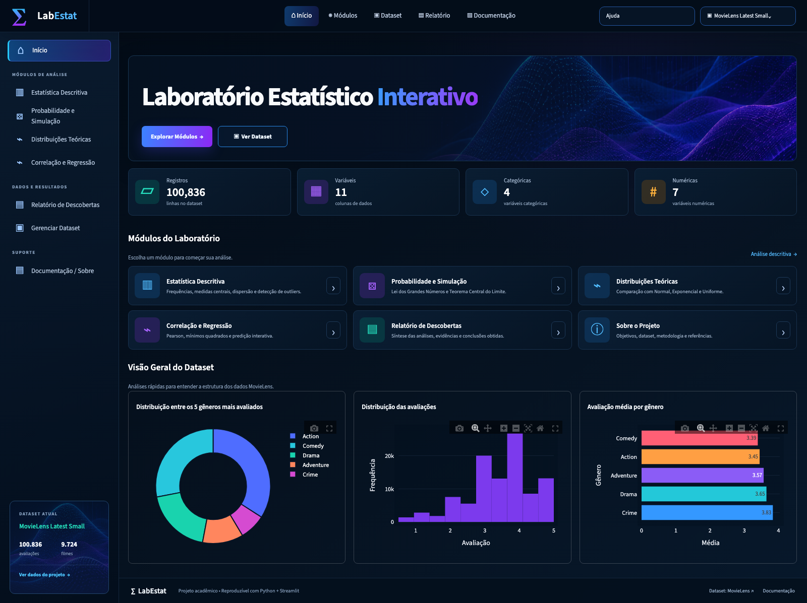
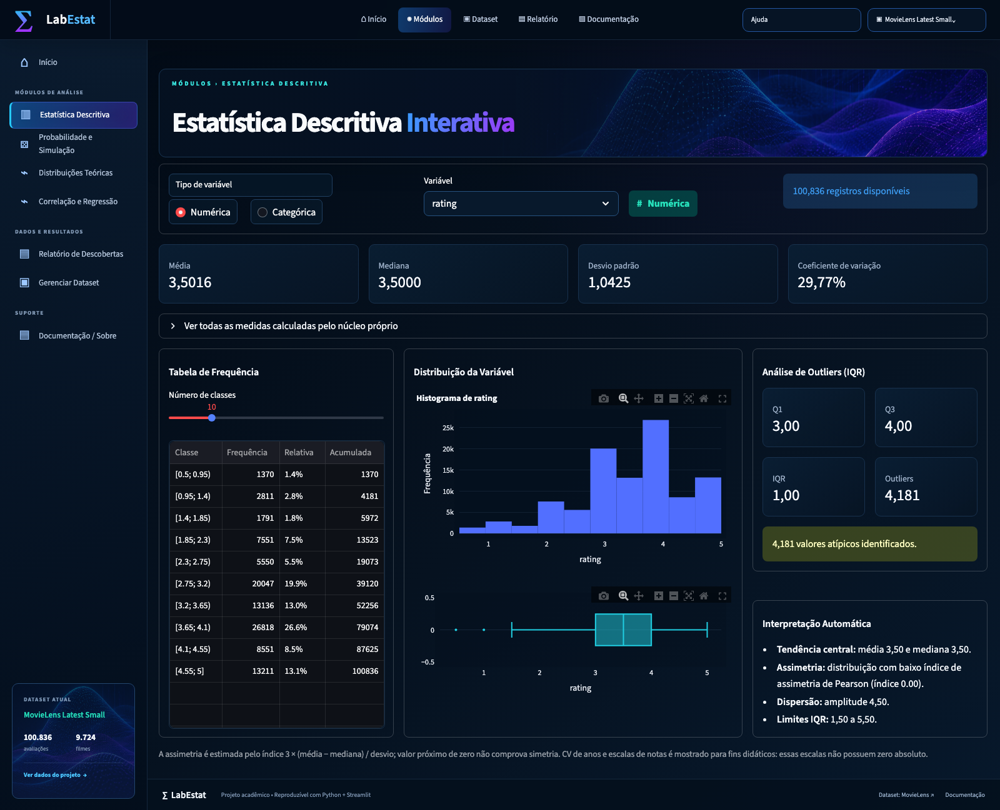
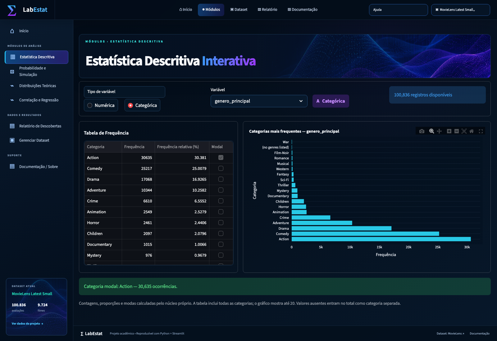
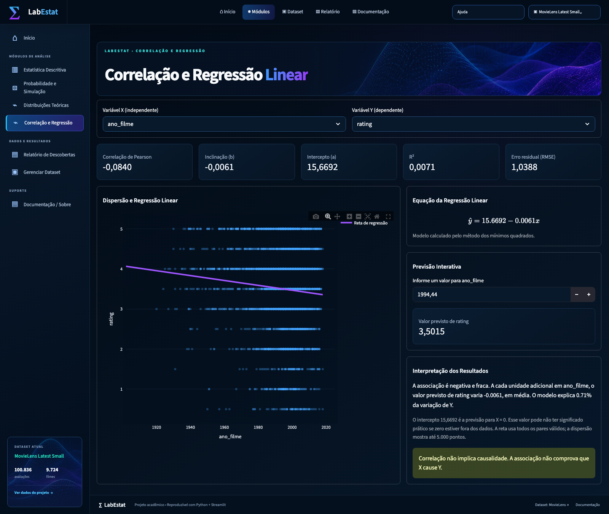

# Laboratório Estatístico Interativo — MovieLens

Aplicação Streamlit desenvolvida para a Sistematização de **Matemática e Estatística para Computação**. O projeto transforma mais de 100 mil avaliações reais de filmes em um laboratório de estatística descritiva, simulação, distribuições e regressão.

**Repositório público:** [oceliasousa/laboratorio-estatistico-movielens](https://github.com/oceliasousa/laboratorio-estatistico-movielens)

## Autora

- **Nome:** Océlia Assis de Sousa
- **RA/DRT:** 72650579
- **Modalidade:** trabalho individual

## Dataset

- Dados crus: [MovieLens Latest Small — arquivo oficial](https://files.grouplens.org/datasets/movielens/ml-latest-small.zip)
- Página do dataset: [MovieLens Latest — GroupLens](https://grouplens.org/datasets/movielens/latest/)
- Versão: `ml-latest-small`, gerada em 26/09/2018
- Dados crus: 100.836 avaliações, 9.742 filmes, 610 usuários e 3.683 aplicações de tags
- Licença e descrição originais: [`data/README.txt`](data/README.txt)

Cada observação analisada é uma avaliação. A base de avaliações inclui **9.724 filmes distintos**; os **9.742 filmes** se referem ao catálogo original. Além das colunas originais, `src/dados.py` deriva `ano_filme`, `ano_avaliacao`, `genero_principal`, `quantidade_generos` e `faixa_avaliacao`. São 11 colunas preparadas, quatro variáveis numéricas de análise e quatro categóricas. IDs não contam como grandezas. Há 18 avaliações sem ano do filme, removidas somente nas análises que usam essa coluna.

## Funcionalidades

- núcleo próprio com média, mediana, moda, amplitude, variâncias, desvios, percentis, quartis, CV, covariância, Pearson e regressão por mínimos quadrados;
- frequências absolutas, relativas e acumuladas próprias; moda categórica com todos os empates e tratamento explícito de ausentes;
- tabela de frequência, histograma, boxplot, barras, IQR e interpretação automática;
- Monte Carlo para Lei dos Grandes Números e Teorema Central do Limite;
- ajuste visual das distribuições Normal, Exponencial e Uniforme;
- correlação, reta, equação, R² e predição interativa;
- testes automatizados comparados com NumPy, SciPy, Pandas e `statistics` (bibliotecas de referência, não usadas no cálculo das medidas exibidas).

## Instalação e execução

Use Python 3.9 a 3.12 com as versões fixadas em `requirements.txt`. A validação local desta refatoração usou Python 3.9. Python 3.13 ou posterior não foi validado com essas dependências.

```bash
cd sistematizacao
python3 -m venv .venv
source .venv/bin/activate          # Windows: .venv\Scripts\activate
python -m pip install -r requirements.txt
streamlit run app.py
```

O navegador abrirá em `http://localhost:8501`.

## Testes

```bash
pytest
```

A tolerância adotada é `rel=1e-10` e `abs=1e-12`. Percentis usam interpolação linear, igual ao padrão do NumPy. Variância/covariância populacional usam divisor `N`; as amostrais, `N-1`. Veja o resultado e o escopo em [Validação](docs/VALIDACAO.md).

Contagens e conjuntos de modas são comparados exatamente; as proporções usam a tolerância acima.
Nas categóricas, ausentes entram no total como categoria separada, sem se misturar com o texto
literal `Ausente`. Empates preservam todas as modas, identificadas na coluna `Modal`.
Os histogramas recebem frequências calculadas em Python, inclusive na tela inicial e no TCL.

## Estrutura

```text
sistematizacao/
├── app.py                    # ponto de entrada e tratamento de erros
├── src/
│   ├── dados.py              # preparação reprodutível
│   ├── minhastats.py         # núcleo matemático próprio
│   ├── analises.py           # frequências, IQR, simulação, ajuste e regressão
│   ├── config.py             # caminhos e configuração compartilhada
│   ├── rotas.py              # registro das oito páginas
│   ├── paginas/              # uma tela por arquivo
│   └── ui/                   # layout, gráficos, formatação e carregamento
├── tests/                    # núcleo, análises, dados e integração das telas
├── styles.css               # estilos e regras responsivas
├── docs/images/             # capturas reais da aplicação
├── data/                     # arquivos crus MovieLens
├── RELATORIO.md
└── requirements.txt
```

## Capturas de tela

### Evidência dos testes automatizados


Capturas de tela





As oito telas estão documentadas no [relatório](RELATORIO.md).

## Onde editar

Textos de cada tela: `src/paginas/`. Cabeçalho, navegação e rodapé: `src/ui/layout.py`.
Mensagens de carregamento: `src/ui/carregamento.py`. Cores e dimensões: `styles.css`.
Fórmulas: `src/minhastats.py`; análises reutilizáveis: `src/analises.py`.

## Aviso analítico

Os resultados descrevem apenas esta amostra do MovieLens. Associação estatística não demonstra causalidade.
Os ajustes contínuos são aproximações de variáveis discretizadas. O primeiro gênero listado
é uma convenção, não uma classificação principal oficial. A licença original acompanha `data/README.txt`.
