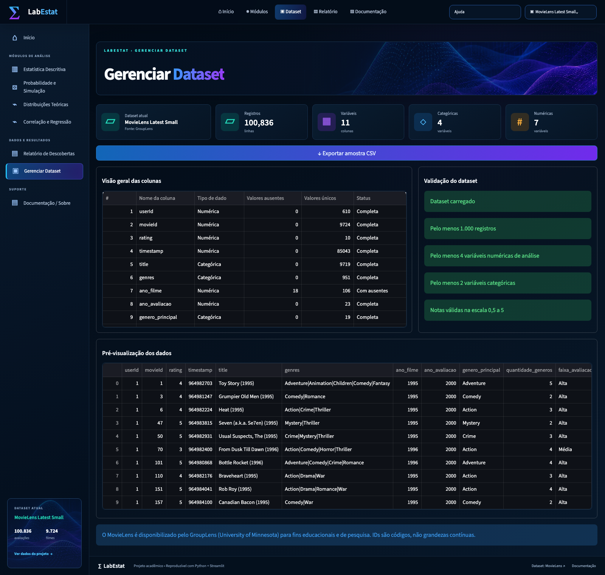
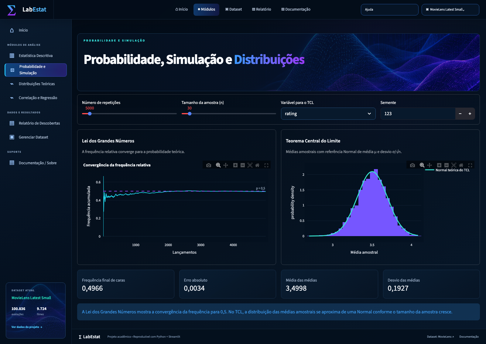
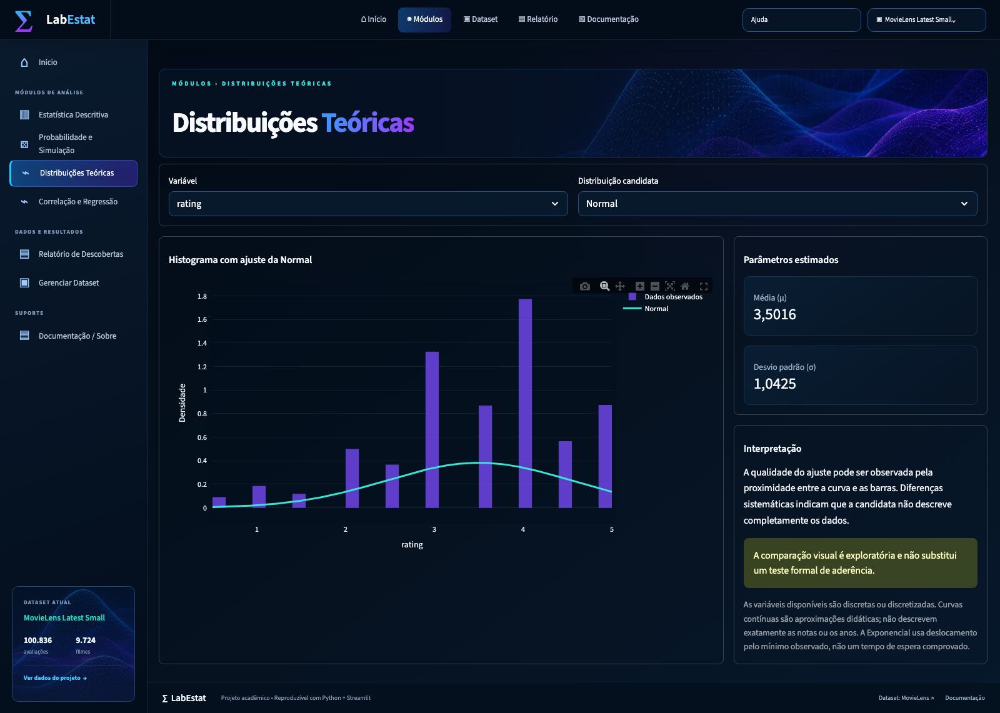
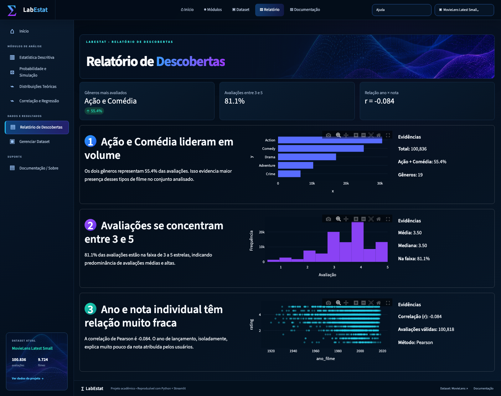

# Relatório — Laboratório Estatístico MovieLens

## 1. Identificação

- **Autora:** Océlia Assis de Sousa
- **RA/DRT:** 72650579
- **Modalidade:** trabalho individual
- **Disciplina:** Matemática e Estatística para Computação
- **Repositório:** [laboratorio-estatistico-movielens](https://github.com/oceliasousa/laboratorio-estatistico-movielens)
- **Dataset:** [MovieLens Latest Small — dados crus oficiais](https://files.grouplens.org/datasets/movielens/ml-latest-small.zip)

## 2. Dataset e justificativa

O MovieLens foi escolhido por ser público, documentado e representar comportamento real de usuários. A versão utilizada reúne 100.836 avaliações de **9.724 filmes avaliados**, feitas por 610 usuários entre 1996 e 2018. O catálogo original contém **9.742 filmes**; 18 deles não possuem avaliação nessa tabela. O tema permite investigar dispersão, associação e distribuições com uma escala adequada para simulações.

A unidade de análise é uma avaliação. Os dados originais (`ratings.csv` e `movies.csv`) são unidos por `movieId`. Foram derivadas as variáveis ano do filme, ano da avaliação, gênero principal, quantidade de gêneros e faixa de avaliação. IDs são disponibilizados para exploração, mas devem ser interpretados como identificadores, não como grandezas quantitativas.

A base preparada oferece as seguintes variáveis para análise, incluindo as derivações descritas acima:

| Tipo | Variáveis |
|---|---|
| Numéricas | `rating`, `ano_filme`, `ano_avaliacao`, `quantidade_generos` |
| Categóricas | `title`, `genres`, `genero_principal`, `faixa_avaliacao` |

A base preparada possui **100.836 registros**, **11 colunas**, **4 variáveis categóricas** e **7 colunas numéricas** no total. Identificadores e timestamp permanecem disponíveis para rastreabilidade, mas não são tratados como grandezas nas interpretações estatísticas.

O marcador `(no genres listed)` significa ausência de gênero listado. Para `quantidade_generos`, ele recebe **zero**, e não um: são 47 avaliações de 34 filmes. O campo categórico preserva o marcador original. O cache é invalidado quando mudam os CSVs ou as regras de preparação.

### Tratamento dos valores ausentes

Há **18 avaliações sem ano do filme** extraível do título (aproximadamente 0,018% da base). `pd.to_numeric(..., errors="coerce")` mantém esses anos como ausentes. Não há imputação: as avaliações permanecem na base e participam das análises de nota, gênero e ano da avaliação. Ao analisar `ano_filme`, são removidas somente as observações sem esse valor; a regressão ano × nota usa **100.818 pares válidos**. O mesmo critério de remoção por variável é aplicado às simulações e distribuições. A junção é validada como muitos-para-um e rejeita avaliações sem filme correspondente.

## 3. Núcleo estatístico próprio

O arquivo `src/minhastats.py` converte entradas em listas e executa explicitamente somas, ordenação, contagens e interpolações. Nenhuma função pronta de estatística é usada nos valores apresentados ao usuário.

Na refatoração, `app.py` passou a cuidar somente da configuração, carga, escolha da rota e tratamento de erros. `src/paginas/` reúne as oito telas; `src/ui/` centraliza layout, formatação, gráficos e carregamento; `src/analises.py` oferece funções testáveis para frequências, IQR, simulações, densidades e resultados da regressão. As funções de análise independem do Streamlit.

Nas medidas numéricas, entradas vazias, não numéricas, NaN e infinitos são rejeitados pelo núcleo. Iteradores são materializados uma vez para evitar consumo indevido. A média usa `math.fsum` para a soma em ponto flutuante. CV com média zero, Pearson com variável constante e R² com Y constante são recusados com mensagens explícitas. As funções categóricas possuem tratamento próprio de ausentes, descrito abaixo.

Para observações \(x_1,\ldots,x_n\):

### Tendência central

$$\bar{x}=\frac{1}{n}\sum_{i=1}^{n}x_i$$

A mediana é o elemento central dos dados ordenados; para tamanho par, é a média dos dois centrais. A moda reúne os valores que atingem a maior frequência.

### Frequências e moda categórica

Para uma categoria \(c\), o núcleo percorre as observações e incrementa um dicionário:

$$n_c=\sum_{i=1}^{N}\mathbf{1}(x_i=c),\qquad f_c=\frac{n_c}{N},\qquad
M=\{c:n_c=\max_j n_j\}.$$

`frequencias_categoricas` calcula as contagens; `moda_categorica` retorna todas as categorias
de frequência máxima. A ordenação é decrescente por frequência e, em empates, preserva a ordem
da primeira ocorrência. Se todas as categorias empatam, todas são modais, conforme a convenção
de `statistics.multimode`; a tela informa que não há moda única.

`None` e `NaN` são agrupados como ausentes. Na preparação, Pandas apenas identifica os marcadores
`pd.NA`/`NaT` e os converte para `None`; não calcula contagens nem modas. Os ausentes são incluídos
no denominador \(N\) e recebem um rótulo visual distinto de qualquer categoria literal existente.
A tabela marca todas as modas na coluna `Modal`, mesmo quando o gráfico limita a exibição a 20 categorias.

`frequencias_relativas` calcula \(n_i/N\), e `frequencias_acumuladas` calcula
\(F_k=\sum_{i=1}^{k}n_i\) para as classes numéricas ordenadas. Não se atribui frequência
acumulada a gêneros nominais, pois não há ordem natural entre eles.

### Dispersão

$$A=x_{\max}-x_{\min}$$

$$\sigma^2=\frac{\sum_{i=1}^{n}(x_i-\bar{x})^2}{n},\qquad
s^2=\frac{\sum_{i=1}^{n}(x_i-\bar{x})^2}{n-1}$$

Os desvios padrão são as raízes das respectivas variâncias. O coeficiente de variação amostral é:

$$CV=\frac{s}{|\bar{x}|}\times100\%$$

O módulo da média mantém o CV não negativo, inclusive para entradas com média negativa. Média zero é recusada. Quando $|\bar{x}| \leq 10^{-10}\max_i|x_i|$, a função emite `RuntimeWarning` sobre instabilidade por cancelamento; o limiar é relativo à escala, evitando confundir números pequenos com média próxima de zero em relação aos dados. O CV é apenas didático para anos e notas, que não possuem zero absoluto.

### Percentis e quartis

Para percentil \(p\), ordenam-se os dados e calcula-se \(h=(n-1)p/100\). Quando \(h\) não é inteiro, usa-se interpolação linear entre as posições vizinhas. Os quartis são \(P_{25}\), \(P_{50}\) e \(P_{75}\). Outliers ficam abaixo de \(Q_1-1{,}5IQR\) ou acima de \(Q_3+1{,}5IQR\), com \(IQR=Q_3-Q_1\).

### Covariância e correlação

$$s_{xy}=\frac{\sum_{i=1}^{n}(x_i-\bar{x})(y_i-\bar{y})}{n-1}$$

$$r=\frac{s_{xy}}{s_xs_y}$$

### Regressão linear simples

O modelo é \(\hat{y}=b_0+b_1x\), com:

$$b_1=\frac{\sum(x_i-\bar{x})(y_i-\bar{y})}{\sum(x_i-\bar{x})^2},\qquad
b_0=\bar{y}-b_1\bar{x}$$

$$R^2=1-\frac{\sum(y_i-\hat{y}_i)^2}{\sum(y_i-\bar{y})^2}$$

## 4. Validação

A suíte em `tests/` confronta as medidas com NumPy, SciPy, Pandas ou `statistics`. Foram definidos `rel=1e-10` e `abs=1e-12` para acomodar pequenas diferenças de ponto flutuante. Contagens e modas são comparadas exatamente. Casos inválidos (amostra vazia, percentil fora da faixa, variância com uma observação e variável constante) também são testados.

Comando de validação:

```bash
pytest
```

Resultado da revisão de 21/09/2026: **149 testes aprovados**. A suíte inclui núcleo, análises, preparação dos dados, oito rotas, estados categóricos, Sturges, TCL com n = 2 e o aviso de CV instável. A tela Sobre disponibiliza somente os documentos existentes, README e relatório.

Ambiente: Python 3.9, Streamlit 1.50.0, Pandas 2.3.3, NumPy 2.0.2, SciPy 1.13.1, Plotly 6.9.0 e pytest 8.4.2. A validação foi executada no ambiente virtual local; não cobre todas as combinações de sistemas e versões.

### Comparação numérica reproduzível

A tabela abaixo é produzida por `python scripts/validar_numeros.py`. O vetor numérico é `[1.2, 2.5, 2.5, 4.1, 8.0, -1.3]`; os pares são X = `[1, 2, 3, 4, 5, 6]` e Y = `[2.1, 3.9, 6.2, 7.8, 10.1, 12.2]`. Para categorias, usam-se `[1, 2, 2, 3, 3, 3]`. Histogramas usam cinco classes e densidades teóricas são comparadas em 100 pontos entre −3 e 10. A diferença informada é o máximo absoluto entre os componentes de cada resultado, nesses exemplos, não em toda a suíte.

Para valores numéricos, aceita-se diferença de até `max(1e-12, 1e-10 × |referência|)`. Contagens e modas exigem igualdade exata.

| Função / resultado | Referência | Maior diferença absoluta | Tolerância |
|---|---|---:|---|
| media | NumPy.mean | 0.000e+00 | rel=1e-10; abs=1e-12 |
| mediana | NumPy.median | 0.000e+00 | rel=1e-10; abs=1e-12 |
| amplitude | NumPy.ptp | 0.000e+00 | rel=1e-10; abs=1e-12 |
| variancia_populacional | NumPy.var(ddof=0) | 0.000e+00 | rel=1e-10; abs=1e-12 |
| variancia_amostral | NumPy.var(ddof=1) | 0.000e+00 | rel=1e-10; abs=1e-12 |
| desvio_padrao_populacional | NumPy.std(ddof=0) | 0.000e+00 | rel=1e-10; abs=1e-12 |
| desvio_padrao_amostral | NumPy.std(ddof=1) | 0.000e+00 | rel=1e-10; abs=1e-12 |
| coeficiente_variacao | SciPy.variation(ddof=1) × 100 | 0.000e+00 | rel=1e-10; abs=1e-12 |
| quartis | NumPy.percentile(25,50,75) | 0.000e+00 | rel=1e-10; abs=1e-12 |
| moda | statistics.multimode | 0.000e+00 | Exata |
| percentil | NumPy.percentile | 0.000e+00 | rel=1e-10; abs=1e-12 |
| covariancia (amostral=False) | NumPy.cov(ddof=0) | 0.000e+00 | rel=1e-10; abs=1e-12 |
| covariancia (amostral=True) | NumPy.cov(ddof=1) | 8.882e-16 | rel=1e-10; abs=1e-12 |
| correlacao_pearson | SciPy.pearsonr | 0.000e+00 | rel=1e-10; abs=1e-12 |
| regressao_linear: inclinação | SciPy.linregress.slope | 0.000e+00 | rel=1e-10; abs=1e-12 |
| regressao_linear: intercepto | SciPy.linregress.intercept | 0.000e+00 | rel=1e-10; abs=1e-12 |
| regressao_linear: R² | SciPy.linregress.rvalue² | 2.220e-16 | rel=1e-10; abs=1e-12 |
| frequencias_categoricas | NumPy.unique(return_counts) | 0.000e+00 | Exata |
| moda_categorica | statistics.multimode | 0.000e+00 | Exata |
| frequencias_relativas | NumPy: contagens / soma | 0.000e+00 | rel=1e-10; abs=1e-12 |
| frequencias_acumuladas | NumPy.cumsum | 0.000e+00 | Exata |
| tabela_frequencias | NumPy.histogram | 0.000e+00 | Exata |
| densidades do histograma | NumPy.histogram(density=True) | 1.388e-17 | rel=1e-10; abs=1e-12 |
| Densidade Normal | SciPy: Normal | 2.776e-17 | rel=1e-10; abs=1e-12 |
| Densidade Exponencial | SciPy: Exponencial | 0.000e+00 | rel=1e-10; abs=1e-12 |
| Densidade Uniforme | SciPy: Uniforme | 0.000e+00 | rel=1e-10; abs=1e-12 |


### Cobertura adicional

Os testes também incluem dados aleatórios com semente fixa, amostras unitárias, constantes, vazias, tipos inválidos, NaN, infinito, iteradores, pares de tamanhos diferentes, empates de moda e categorias ausentes. As telas são verificadas com `value_counts` e `px.histogram` bloqueados para detectar delegação indevida de contagens a bibliotecas. Simulações usam margens próprias para resultados aleatórios; a comparação da correlação publicada usa tolerância de arredondamento de `1e-4`.

Além dos testes do núcleo, as oito rotas da interface (`inicio`, `descritiva`, `simulacoes`, `distribuicoes`, `regressao`, `descobertas`, `dados` e `sobre`) foram executadas com o mecanismo de testes do Streamlit e não apresentaram exceções.


## 5. Módulos da aplicação

### Módulo 0 — Dados

Exibe dimensões, variáveis, valores ausentes, prévia da base preparada e download de amostra.

### Módulo 1 — Núcleo estatístico

Documenta todas as funções estatísticas exigidas, as bibliotecas usadas como referência, a tolerância numérica dos testes e as fórmulas implementadas. A regressão linear própria é adicionada às medidas obrigatórias. Os resultados exibidos nas análises vêm de `src/minhastats.py`.

### Módulo 2 — Descritiva

O usuário seleciona uma variável. Para numéricas, vê as medidas próprias, frequências em classes, histograma, boxplot, assimetria de Pearson e outliers por IQR. Para categóricas, vê frequências absoluta/relativa, todas as categorias modais e gráfico de barras, calculados pelas funções próprias.

O número inicial de classes segue Sturges: $k=\lceil1+3{,}322\log_{10}(n)\rceil$, com $n$ igual à quantidade de valores válidos. Para as 100.836 notas, são **18 classes**. O usuário pode ajustar esse número para comparar a granularidade.

Tabela e histograma compartilham a mesma contagem própria e as mesmas bordas: classes fechadas à esquerda e abertas à direita, exceto a última, fechada dos dois lados. O boxplot recebe Q1, mediana, Q3 e bigodes já calculados pelo núcleo. A tabela categórica inclui todas as categorias; somente o gráfico limita a visualização às 20 mais frequentes. Para `rating`, Q1 = 3, Q3 = 4 e IQR = 1: há **4.181 observações** abaixo do limite inferior 1,5.

### Módulo 3 — Simulação

Na Lei dos Grandes Números, lançamentos de moeda mostram a frequência de caras convergindo para 0,5. No TCL, amostras com reposição de uma variável geram médias calculadas pelo núcleo próprio; tamanho, repetições e semente são controláveis.

A referência do TCL usa a média da população empírica e seu desvio populacional dividido por √n, em vez de ajustar a curva às próprias médias simuladas. Os resultados da simulação ficam em cache por dados e parâmetros. A proximidade da Normal pode ser examinada repetindo a simulação com n = 2, 30 e 100 para `ano_filme`, cuja distribuição apresenta concentração nos anos mais recentes e cauda em direção aos filmes antigos; não é uma garantia de aproximação perfeita para toda amostra.

### Módulo 4 — Distribuições

O histograma em densidade pode ser comparado às curvas Normal, Exponencial e Uniforme. Seus parâmetros são estimados a partir dos dados. A avaliação é visual e explicitamente apresentada como exploratória.

As densidades também são próprias, em `src/analises.py`:

$$f_N(x)=\frac{1}{\sigma\sqrt{2\pi}}e^{-\frac12((x-\mu)/\sigma)^2}$$

$$f_E(x)=\frac{1}{\theta}e^{-(x-a)/\theta},\ x\ge a;\qquad f_U(x)=\frac{1}{b-a},\ a\le x\le b$$

Fora do suporte, as densidades Exponencial e Uniforme são zero. Na Normal, μ e σ vêm do núcleo. Na Exponencial deslocada, a é o mínimo e θ é a média de x − a. Na Uniforme, a e b são os extremos observados. Essas curvas aproximam variáveis discretas/discretizadas; não implicam que notas ou anos sejam tempos de espera ou medidas contínuas.

#### Discussão do ajuste às notas

Para `rating`, a Normal estimada tem **μ = 3,5016** e **σ = 1,0425**. Ela descreve um centro próximo de 3,5, mas não representa os saltos de meia estrela nem os limites da escala: atribui probabilidade a valores abaixo de 0,5 e acima de 5. A aparência muda com a largura das classes, pois os dados são discretos.

A Uniforme entre 0,5 e 5 pressupõe densidade constante. Isso contrasta com a concentração de **81,09%** das observações entre 3 e 5. A Exponencial deslocada, com localização 0,5 e escala **3,0016**, atinge sua maior densidade na menor nota e decresce, enquanto os dados se concentram em notas mais altas. Essas duas candidatas não reproduzem a concentração observada. A Normal também não é um modelo exato: nenhuma das curvas contínuas substitui as frequências das notas. A conclusão é exploratória, sem teste formal de aderência ou declaração de uma distribuição vencedora.

### Módulo 5 — Correlação e regressão

O usuário escolhe X e Y. Todos os pares válidos entram no cálculo próprio de Pearson e mínimos quadrados; até 5.000 pontos são amostrados somente para tornar o gráfico legível. A tela fornece equação, R², predição e o alerta de não causalidade.

### Módulo 6 — Relatório de descobertas

Reúne três conclusões calculadas a partir do mesmo conjunto de dados usado nos demais módulos. Cada descoberta apresenta indicadores numéricos, gráfico correspondente, evidências e uma interpretação que evita afirmações causais indevidas.

## 6. Três descobertas estatísticas

### 1. Ação e Comédia lideram em volume

Considerando o primeiro gênero listado, **Ação possui 30.635 avaliações** e **Comédia, 25.217**. Juntas, representam **55,39%** das 100.836 avaliações. O resultado mede volume de avaliações, não quantidade distinta de filmes ou preferência causal.

### 2. As avaliações se concentram entre 3 e 5

**81,09%** das notas estão entre 3 e 5 estrelas, inclusive. A nota média é **3,5016** e a mediana é **3,5** na escala de 0,5 a 5. O centro fica acima do ponto médio teórico (2,75), sem permitir concluir por que usuários selecionam ou avaliam filmes dessa maneira.

### 3. Ano de lançamento explica muito pouco da nota individual

A correlação de Pearson entre ano do filme e nota é **−0,0840**. O sinal é levemente negativo, mas a magnitude é muito pequena: uma regressão simples baseada apenas no ano tem poder explicativo baixo.

Na regressão de ano do filme para nota, **R² = 0,007064**, aproximadamente **0,71%** da variação das notas. Essas três descobertas são as mesmas apresentadas na tela Relatório de Descobertas.

## 7. Limitações e ética

- Os participantes do MovieLens não representam toda a população de espectadores.
- As observações não são independentes: cada usuário avalia vários filmes.
- `genero_principal` depende da ordem fornecida no arquivo.
- Correlação e regressão simples não estabelecem causalidade.
- IDs não devem receber interpretação métrica, embora permaneçam disponíveis para fins didáticos.
- CV em anos e notas é didático: essas escalas não possuem zero absoluto e não justificam comparação proporcional de dispersão.
- Índice de assimetria próximo de zero não comprova simetria; histogramas e boxplots complementam a interpretação.
- A validação por tipos e contagens não elimina problemas de representatividade ou dependência entre observações.

## 8. Evidências e reprodutibilidade

O resultado dos testes está registrado na Seção 4 e na imagem `docs/images/testes-pytest.png`. A execução pode ser reproduzida com os comandos documentados no `README.md`.

O repositório Git local possui commits separados para o núcleo estatístico e preparação dos dados, a aplicação Streamlit, a documentação e a validação final. Essa separação facilita a identificação da evolução técnica do projeto.

Situação dos materiais de entrega:

- **Repositório público:** [oceliasousa/laboratorio-estatistico-movielens](https://github.com/oceliasousa/laboratorio-estatistico-movielens).
- **Capturas da aplicação:** em `docs/images/`.

## 9. Capturas dos módulos

As capturas da aplicação foram registradas em 13/09/2026. Na revisão de 21/09/2026, a descritiva passou a iniciar com Sturges, o TCL passou a aceitar n = 2 e a tela Sobre deixou de oferecer o checklist removido. Portanto, as imagens documentam a interface anterior a esses ajustes; a imagem dos testes registra a execução atual. Testes de integração não substituem uma revisão visual completa no navegador.

### Início


### Dados reais — módulo 0



### Núcleo e documentação — módulo 1


### Descritiva — módulo 2


Estado categórico, com frequências próprias e identificação de todas as categorias modais:


### Simulação — módulo 3



### Distribuições — módulo 4



### Regressão — módulo 5


### Descobertas — módulo 6



## 10. Escopo desta versão

A documentação é composta pelo README e por este relatório, acompanhados de código, dados, testes e capturas. Por decisão da autora, esta versão não inclui vídeo de demonstração nem PDF de envio. Isso delimita os materiais disponibilizados; os entregáveis previstos no guia que não foram produzidos não são declarados como concluídos.
