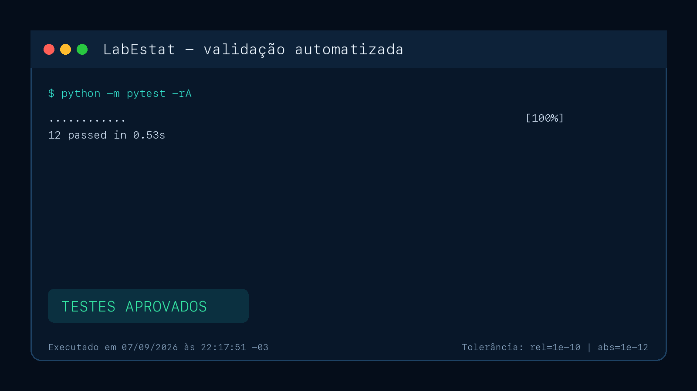

# Relatório — Laboratório Estatístico MovieLens

## 1. Identificação

- **Autora:** Océlia Assis de Sousa
- **RA/DRT:** 72650579
- **Modalidade:** trabalho individual
- **Disciplina:** Matemática e Estatística para Computação
- **Dataset:** [MovieLens Latest Small — dados crus oficiais](https://files.grouplens.org/datasets/movielens/ml-latest-small.zip)

## 2. Dataset e justificativa

O MovieLens foi escolhido por ser público, documentado e representar comportamento real de usuários. A versão utilizada reúne 100.836 avaliações de 9.742 filmes feitas por 610 usuários entre 1996 e 2018. O tema permite investigar tendências, dispersão, associação e distribuições com uma escala adequada para simulações.

A unidade de análise é uma avaliação. Os dados originais (`ratings.csv` e `movies.csv`) são unidos por `movieId`. Foram derivadas as variáveis ano do filme, ano da avaliação, gênero principal, quantidade de gêneros e faixa de avaliação. IDs são disponibilizados para exploração, mas devem ser interpretados como identificadores, não como grandezas quantitativas.

## 3. Núcleo estatístico próprio

O arquivo `src/minhastats.py` converte entradas em listas e executa explicitamente somas, ordenação, contagens e interpolações. Nenhuma função pronta de estatística é usada nos valores apresentados ao usuário.

Para observações \(x_1,\ldots,x_n\):

### Tendência central

$$\bar{x}=\frac{1}{n}\sum_{i=1}^{n}x_i$$

A mediana é o elemento central dos dados ordenados; para tamanho par, é a média dos dois centrais. A moda reúne os valores que atingem a maior frequência.

### Dispersão

$$A=x_{\max}-x_{\min}$$

$$\sigma^2=\frac{\sum_{i=1}^{n}(x_i-\bar{x})^2}{n},\qquad
s^2=\frac{\sum_{i=1}^{n}(x_i-\bar{x})^2}{n-1}$$

Os desvios padrão são as raízes das respectivas variâncias. O coeficiente de variação amostral é:

$$CV=\frac{s}{|\bar{x}|}\times100\%$$

### Percentis e quartis

Para percentil \(p\), ordenam-se os dados e calcula-se \(h=(n-1)p/100\). Quando \(h\) não é inteiro, usa-se interpolação linear entre as posições vizinhas. Os quartis são \(P_{25}\), \(P_{50}\) e \(P_{75}\). Outliers ficam abaixo de \(Q_1-1{,}5IQR\) ou acima de \(Q_3+1{,}5IQR\), com \(IQR=Q_3-Q_1\).

### Covariância e correlação

$$s_{xy}=\frac{\sum_{i=1}^{n}(x_i-\bar{x})(y_i-\bar{y})}{n-1}$$

$$r=\frac{s_{xy}}{s_xs_y}$$

### Regressão linear simples

O modelo é \(\hat{y}=b_0+b_1x\), com:

$$b_1=\frac{\sum(x_i-\bar{x})(y_i-\bar{y})}{\sum(x_i-\bar{x})^2},\qquad
b_0=\bar{y}-b_1\bar{x}$$

$$R^2=1-\frac{\sum(y_i-\hat{y}_i)^2}{\sum(y_i-\bar{y})^2}$$

## 4. Validação

Os testes em `tests/test_minhastats.py` confrontam todas as funções com NumPy ou SciPy. Foram definidos `rel=1e-10` e `abs=1e-12` para acomodar pequenas diferenças de ponto flutuante. Casos inválidos (amostra vazia, percentil fora da faixa, variância com uma observação e variável constante) também são testados.

Comando de validação:

```bash
pytest
```

Resultado obtido: **12 testes aprovados**.



## 5. Módulos da aplicação

### Módulo 0 — Dados

Exibe dimensões, variáveis, valores ausentes, prévia da base preparada e download de amostra.

### Módulo 1 — Núcleo estatístico

Documenta todas as funções estatísticas exigidas, as bibliotecas usadas como referência, a tolerância numérica dos testes e as fórmulas implementadas. A regressão linear própria é adicionada às medidas obrigatórias. Os resultados exibidos nas análises vêm de `src/minhastats.py`.

### Módulo 2 — Descritiva

O usuário seleciona uma variável. Para numéricas, vê as medidas próprias, frequências em classes, histograma, boxplot, assimetria de Pearson e outliers por IQR. Para categóricas, vê frequências absoluta/relativa e gráfico de barras.

### Módulo 3 — Simulação

Na Lei dos Grandes Números, lançamentos de moeda mostram a frequência de caras convergindo para 0,5. No TCL, amostras com reposição de uma variável geram médias calculadas pelo núcleo próprio; tamanho, repetições e semente são controláveis.

### Módulo 4 — Distribuições

O histograma em densidade pode ser comparado às curvas Normal, Exponencial e Uniforme. Seus parâmetros são estimados a partir dos dados. A avaliação é visual e explicitamente apresentada como exploratória.

### Módulo 5 — Correlação e regressão

O usuário escolhe X e Y. Todos os pares válidos entram no cálculo próprio de Pearson e mínimos quadrados; até 5.000 pontos são amostrados somente para tornar o gráfico legível. A tela fornece equação, R², predição e o alerta de não causalidade.

## 6. Três descobertas estatísticas

### 1. As avaliações se concentram acima do ponto médio

A nota média é **3,5016** e a mediana é **3,5** na escala de 0,5 a 5. Isso indica que o centro das avaliações está acima do ponto médio teórico (2,75), embora não permita concluir por que usuários selecionam ou avaliam filmes dessa maneira.

### 2. Ação domina em volume de avaliações

Considerando o primeiro gênero listado como gênero principal, **Ação possui 30.635 avaliações**, seguida por Comédia (25.217) e Drama (17.068). O resultado mede volume de avaliações, não necessariamente quantidade distinta de filmes ou preferência causal.

### 3. Ano de lançamento explica muito pouco da nota individual

A correlação de Pearson entre ano do filme e nota é **−0,0840**. O sinal é levemente negativo, mas a magnitude é muito pequena: uma regressão simples baseada apenas no ano terá poder explicativo baixo. Similarmente, quantidade de gêneros e nota têm \(r=0{,}0355\). Logo, metadados estruturais isolados não explicam bem a avaliação individual.

Como verificação adicional, entre filmes com pelo menos 100 avaliações, *The Shawshank Redemption (1994)* apresenta a maior média (**4,4290**, 317 avaliações). O limiar evita destacar filmes vistos por pouquíssimos usuários.

## 7. Limitações e ética

- Os participantes do MovieLens não representam toda a população de espectadores.
- As observações não são independentes: cada usuário avalia vários filmes.
- `genero_principal` depende da ordem fornecida no arquivo.
- Correlação e regressão simples não estabelecem causalidade.
- IDs não devem receber interpretação métrica, embora permaneçam disponíveis para fins didáticos.

## 8. Evidências visuais e vídeo

O resultado dos testes está registrado na Seção 4. Ainda é necessário salvar capturas atuais das telas da aplicação e gravar o vídeo de demonstração.

- **Vídeo:** aguardando gravação e publicação.
- **Repositório público:** aguardando criação e publicação.

## 9. Conclusão

O laboratório liga fórmulas a implementações verificáveis e permite observar empiricamente convergência, distribuição amostral, ajuste teórico e associação. A validação automatizada reduz o risco de erros no núcleo, enquanto a interface torna hipóteses e limitações acessíveis ao usuário.
